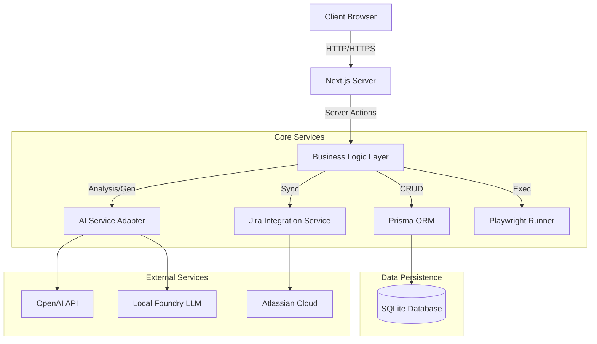

# QA Nexus: System Design & Testing Epics

## 📚 Document Overview
This document serves as the central repository for the QA Nexus platform's design specifications and testing requirements. It is intended for use in Jira (as Epics/Stories) and Confluence (as Design Documentation).

---

# Part 1: System Design Document

## 1. Executive Summary
QA Nexus is an enterprise-grade, AI-powered Quality Assurance platform designed to bridge the gap between requirements, manual testing, and test automation. It leverages advanced LLMs (OpenAI/Foundry) to analyze requirements, generate test cases, and create automated Playwright scripts, while providing full traceability from Jira Epics to Defects.

## 2. System Architecture

### 2.1 High-Level Architecture
The application follows a modern Next.js App Router architecture with Server Actions for backend logic, ensuring type safety and performance.

### 2.2 Technology Stack
- **Frontend**: Next.js 16 (React 19), Tailwind CSS, Shadcn UI, Lucide Icons, Recharts
- **Backend**: Next.js Server Actions, Node.js 18+
- **Database**: SQLite with Prisma ORM v7.0
- **Testing Engine**: Playwright (for automation execution)
- **AI Integration**: OpenAI SDK (compatible with OpenAI & Local LLMs)
- **Validation**: Zod schemas

## 3. Data Model (Core Entities)

### 3.1 Primary Entities
- **User**: System users with roles (Admin, Tester, Developer).
- **TestCase**: Individual test scenarios with steps, priority, and status.
- **TestSuite**: Collections of test cases, often mapped to Jira Epics.
- **TestRun**: Execution instances of Test Suites.
- **TestResult**: Outcome (Pass/Fail) of a Test Case within a Run.
- **Defect**: Bugs found during testing, linked to Jira Issues.
- **DocumentAnalysis**: AI analysis of requirements (Risks, Gaps).
- **ApiCollection/Request**: API testing structures.

### 3.2 Key Relationships
- **Traceability**: `DocumentAnalysis` -> `TestSuite` -> `TestCase` -> `TestResult` -> `Defect`
- **Jira Mapping**: `JiraEpic` -> `TestSuite`, `JiraStory` -> `TestCase`, `JiraIssue` -> `Defect`

## 4. Key Modules

### 4.1 AI Core
- **Requirement Analysis**: Extracts risks, gaps, and requirements from text.
- **Test Generation**: Creates structured test cases from requirements.
- **Automation Generation**: Converts manual steps to Playwright code.
- **Insight Engine**: Predicts flakiness and failure risks.

### 4.2 Automation Engine
- **Code Generator**: Translates natural language steps to TypeScript/Playwright.
- **Execution Runner**: Runs Playwright tests in a headless browser environment.
- **Result Parser**: Ingests JSON results back into the database.

### 4.3 API Testing Engine
- **Request Builder**: Visual interface for HTTP requests.
- **Collection Runner**: Sequential execution of request groups.
- **AI Assertion Generator**: Creates validation logic from responses.

---

# Part 2: Epics & User Stories

Use these Epics to organize your Jira backlog. Each User Story represents a testable feature.

## 🚀 Epic 1: Dashboard & Analytics
**Description**: Provide a centralized view of quality metrics, recent activity, and AI insights to help teams make data-driven decisions.

### User Stories
1.  **View Overall Metrics**
    *   *As a QA Manager, I want to see total test cases, pass rates, and open defects so that I can gauge project health.*
    *   **Acceptance Criteria**: Display cards for Total Tests, Pass Rate %, Open Defects, and Automation Coverage %.
2.  **Analyze Execution Trends**
    *   *As a Tester, I want to see a chart of test executions over the last 30 days so that I can track testing velocity.*
    *   **Acceptance Criteria**: Line chart showing Pass/Fail counts by date.
3.  **View Recent Activity**
    *   *As a User, I want to see a feed of recent actions (created tests, runs, comments) so that I stay updated.*
    *   **Acceptance Criteria**: List of last 10 activities with user, action type, and timestamp.
4.  **Monitor AI Insights**
    *   *As a Lead, I want to see flaky tests and failure predictions so that I can prioritize maintenance.*
    *   **Acceptance Criteria**: Dashboard widget listing top 5 risky/flaky tests.

## 🧪 Epic 2: Test Case Management
**Description**: Comprehensive management of manual test cases, including creation, editing, organization, and versioning.

### User Stories
1.  **Create Manual Test Case**
    *   *As a Tester, I want to create a test case with title, steps, expected results, and priority.*
    *   **Acceptance Criteria**: Form saves successfully; appears in list; supports rich text or step-by-step input.
2.  **Edit & Delete Test Cases**
    *   *As a Tester, I want to update or remove test cases as requirements change.*
    *   **Acceptance Criteria**: Edit updates DB; Delete removes (or archives) the case.
3.  **Filter & Search Test Cases**
    *   *As a User, I want to filter tests by priority, status, and suite.*
    *   **Acceptance Criteria**: Search bar works; dropdown filters update the list list.
4.  **AI Test Improvement**
    *   *As a Tester, I want AI to suggest improvements to my test steps for clarity.*
    *   **Acceptance Criteria**: "Improve with AI" button updates the description/steps text.

## 📦 Epic 3: Test Suite Management
**Description**: Grouping test cases into logical suites for organization and batch execution.

### User Stories
1.  **Create Test Suite**
    *   *As a Lead, I want to create a suite (e.g., "Smoke Test", "Regression") and assign test cases to it.*
    *   **Acceptance Criteria**: Suite creation form; ability to select multiple test cases to add.
2.  **Link Suite to Jira Epic**
    *   *As a Manager, I want to link a suite to a Jira Epic Key so that I can track coverage.*
    *   **Acceptance Criteria**: Input field for Jira Key; fetches Epic details if integration is active.
3.  **Automation Readiness Check**
    *   *As an Automation Engineer, I want to check if a suite is ready for automation (all tests passing manually).*
    *   **Acceptance Criteria**: Visual indicator of % tests passing; "Ready for Automation" badge.

## ▶️ Epic 4: Test Execution & Runs
**Description**: Executing test suites, recording results, and tracking history.

### User Stories
1.  **Start Test Run**
    *   *As a Tester, I want to start a new execution run for a specific suite.*
    *   **Acceptance Criteria**: Creates a `TestRun` record; status set to "In Progress".
2.  **Execute Test Steps**
    *   *As a Tester, I want to mark individual test cases as Pass, Fail, or Skipped during a run.*
    *   **Acceptance Criteria**: Interface to cycle through tests; buttons for status; progress bar updates.
3.  **Add Evidence & Notes**
    *   *As a Tester, I want to attach screenshots or notes to a failed test result.*
    *   **Acceptance Criteria**: Text area for notes; file upload or URL input for evidence.
4.  **View Run History**
    *   *As a User, I want to see past execution runs and their outcomes.*
    *   **Acceptance Criteria**: List of past runs; detail view showing results of each case in that run.

## 🐛 Epic 5: Defect Management & Jira Integration
**Description**: Tracking bugs found during testing and syncing them with Jira.

### User Stories
1.  **Create Defect from Failure**
    *   *As a Tester, I want to create a defect immediately when a test fails.*
    *   **Acceptance Criteria**: "Create Defect" button on failed test result; pre-fills data from test case.
2.  **Sync with Jira**
    *   *As a User, I want defects created in QA Nexus to automatically create Jira Issues.*
    *   **Acceptance Criteria**: Jira Issue created; Jira Key saved in QA Nexus; link provided.
3.  **Bi-directional Sync**
    *   *As a User, I want status changes in Jira (e.g., "Done") to reflect in QA Nexus.*
    *   **Acceptance Criteria**: Webhook or polling updates QA Nexus defect status when Jira issue updates.

## 🧠 Epic 6: AI-Powered Document Analysis
**Description**: Using AI to analyze requirements documents and generate test assets.

### User Stories
1.  **Analyze Requirements Text**
    *   *As a QA Lead, I want to paste requirements or select a Jira Epic to analyze for risks and gaps.*
    *   **Acceptance Criteria**: AI returns list of Risks, Gaps, and Missed Requirements.
2.  **Generate Test Cases from Analysis**
    *   *As a Tester, I want to generate a full test suite based on the AI analysis.*
    *   **Acceptance Criteria**: "Generate Tests" button creates Test Cases in DB linked to the analysis.
3.  **Traceability Matrix**
    *   *As a Manager, I want to see which test cases cover which requirements/risks.*
    *   **Acceptance Criteria**: Visual matrix showing relationships between Requirements and Test Cases.

## 🔌 Epic 7: API Testing Platform
**Description**: A complete environment for creating, organizing, and running API tests.

### User Stories
1.  **Visual Request Builder**
    *   *As a Tester, I want a UI to create HTTP requests (GET, POST, etc.) without writing code.*
    *   **Acceptance Criteria**: Inputs for URL, Method, Headers, Body, Params; "Send" button works.
2.  **Import OpenAPI Spec**
    *   *As a Developer, I want to import a Swagger/OpenAPI JSON file to automatically create test collections.*
    *   **Acceptance Criteria**: Upload dialog; parses spec; creates Collections and Requests in DB.
3.  **AI Request Generation**
    *   *As a Tester, I want to describe a request in English and have AI build it for me.*
    *   **Acceptance Criteria**: "Generate" dialog; input prompt; populates Request Builder fields.
4.  **AI Assertion Generation**
    *   *As a Tester, I want AI to analyze a response and suggest validation assertions.*
    *   **Acceptance Criteria**: "Generate Assertions" button; adds checks for status code, schema, and data.

## 🤝 Epic 8: Collaboration
**Description**: Features enabling team communication and review processes.

### User Stories
1.  **Comment on Assets**
    *   *As a User, I want to add comments to test cases, runs, and defects.*
    *   **Acceptance Criteria**: Comment section on detail pages; supports threading.
2.  **Request Review**
    *   *As a Tester, I want to request a peer review for a new test suite.*
    *   **Acceptance Criteria**: "Request Review" action; assigns to user; status changes to "In Review".
3.  **Notifications**
    *   *As a User, I want to be notified when I am mentioned or assigned a review.*
    *   **Acceptance Criteria**: Notification bell icon; list of unread notifications.

## ⚙️ Epic 9: Settings & Configuration
**Description**: System-wide configuration for AI providers and integrations.

### User Stories
1.  **Configure AI Provider**
    *   *As an Admin, I want to switch between OpenAI and Local Foundry LLM.*
    *   **Acceptance Criteria**: Settings form; API Key input for OpenAI; URL input for Foundry; persists to DB.
2.  **Configure Jira Connection**
    *   *As an Admin, I want to set up the Jira URL and API Token.*
    *   **Acceptance Criteria**: Connection test button; secure storage of tokens.
